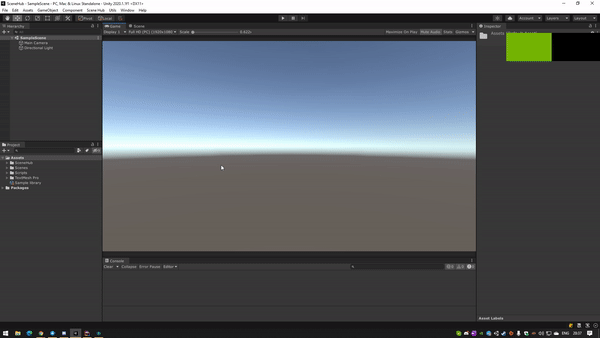
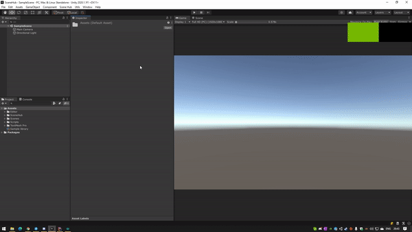

# SceneHub

## How to use

__1.__ _Create library_



__2.__ _Fill it_


__3.__ _Switch!_




## Installation

Open project `manifest.json` file and add next referece:

```
{
  "dependencies": {
    "com.fofanius.scenehub": "https://github.com/Fofanius/SceneHub.git#1.0.0",

    // ...
    // default unity and
    // your dependencies
  }
}
```