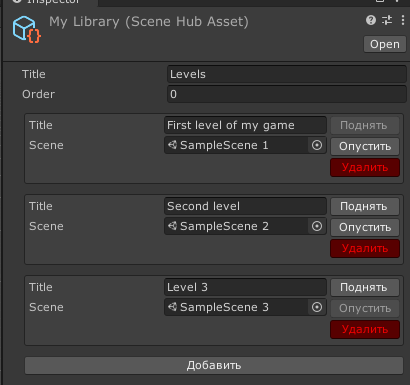
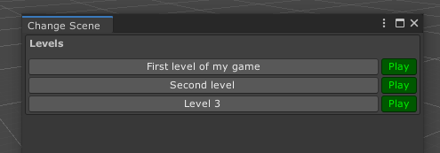

# Scene Hub

Позволяет создавать библиотеки (группы) сцен и удобно перемещяться между ними.

## Создание библиотеки

Создать папку `Assets/Editor` для ассетов, которые храняться только для редактора, или использовать существующую.
 
В такой папке посредством вызова меню `Asset/Create/Scene Hub/Scene Library` создайте библиотеку сцен.
 
 
_На пример, создадим библотеку, в которой будут храниться все уровни игры._
 
 

 

## Переход между сценами

Если в проекте более одного ассета, то становится доступен пункт меню `Scene Hub/Move To`.
 
Используя его Вы открываете следующее окно:
 
 
 
 
 
 Клик по названию ассета пинганет его в `Project` вкладке редактора.
 
 Нажатие на название сцены (или переопределенное имя) сохранит текущую активную и выполнит переход на новую сцену.
 
 Нажатие на `Play` рядом с названием сцены выполнит описанные действия выше и запустит `PlayMode`.